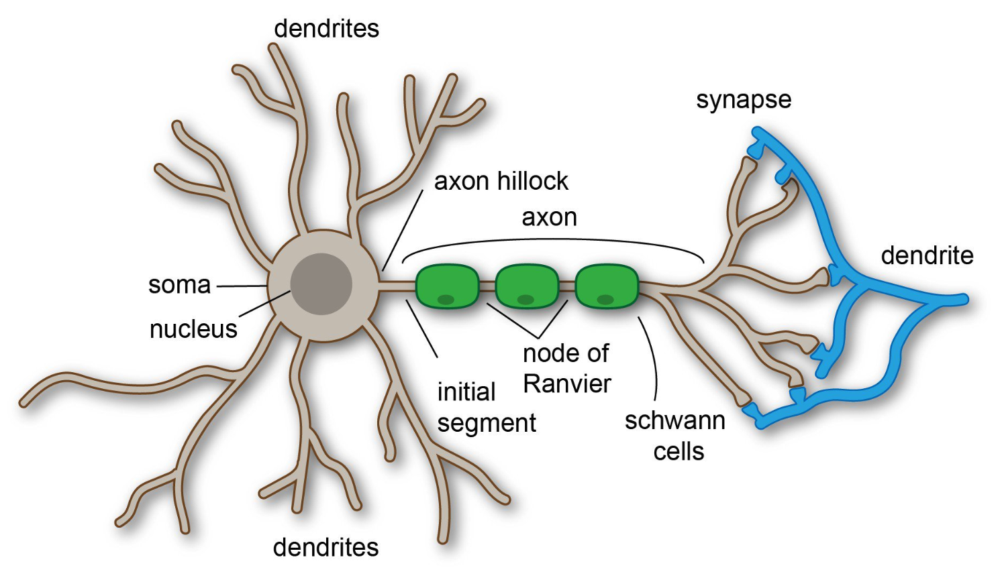
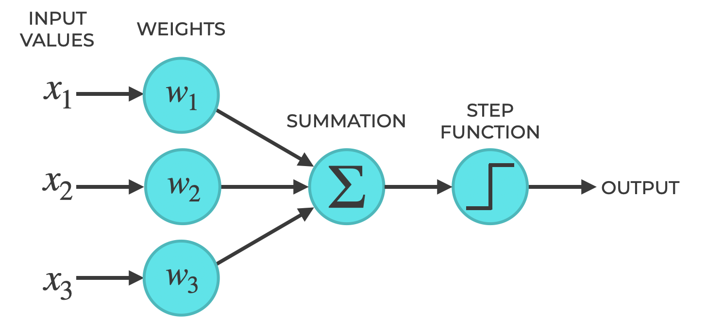

<div style="display: flex; width: 100%;">
    <div style="flex: 1; padding: 0px;">
        <p>© Albert Palacios Jiménez, 2024</p>
    </div>
    <div style="flex: 1; padding: 0px; text-align: right;">
        
    </div>
</div>
<br/>

# Perceptró

El **perceptró** és un algorisme d'intel·ligència artificial que es pot imaginar com una màquina que pren decisions senzilles basades en dades. 

És una manera bàsica d'ensenyar a un programa a reconèixer patrons i classificar informació entre 0 i 1.

El funcionament dels perceptrons s'inspira en el funcionament de les neurones animals. A partir d'unes senyals d'entrada, poden activar o no la senyal de sortida cap a altres neurones:

<center>

<br/>
</center>
<br/>

Amb un sol perceptró només es poden classificar dades **linealment separables**, això vol dir dades que se poden classificar en un "Si" o en un "No".

- Temperatures fredes vs caluroses
- Correu normal o "spam"
- Punts que estàn per sobre o per sota d'una linia en un dibuix
- ...

Amb múltiples perceptrons es formen les **xarxes neurals**, i segons com s'organitzen els perceptrons ja es poden fer classificacions més complexes.

## Parts d'un perceptró:

**Entrades:**

- Imagina que les entrades són com les dades que rep el perceptró per prendre una decisió. Per exemple, podrien ser números binaris (0 i 1), com els que fem servir per representar dades en un ordinador.

    Les entrades són la informació que volem que el perceptró analitzi, com si fos una pregunta que li fem.

**Funció d'activació:**

- És la part que fa els càlculs. La funció d'activació combina totes les entrades i decideix si la màquina ha de "activar-se" o no.

    Es pot pensar com un interruptor: si rep suficient "energia" (les entrades tenen cert valor), s'encén; si no, es queda apagat.


    Aquesta "energia" es calcula sumant totes les entrades i comparant el resultat amb un llindar (un valor que decidim). Si la suma supera el llindar, el perceptró es "activa".

- Els **pesos** es poden imaginar com la importància que donem a cadascuna de les entrades.

    Si una entrada té un pes alt, significa que és més important per a la decisió final. 
    
    Si té un pes baix, significa que és menys important.
Per exemple, si el perceptró rep dues dades, A i B, i el pes d'A és més gran que el de B, llavors A tindrà més influència en la decisió del perceptró.
Biaix:

- El **biaix** és com un ajust que permet al perceptró prendre decisions més flexibles.

    És com establir una línia de partida diferent: encara que les entrades no tinguin molt pes, el biaix pot ajudar a "activar" el perceptró si és prou alt.

    Pots imaginar el biaix com un punt extra que fa més fàcil (o difícil) que el perceptró es posi en marxa. Sense el biaix, el perceptró només es "encendria" si les entrades són molt fortes.

La funció d'activació sempre és:

- Multiplicar cada entrada pel seu pes
- Sumar tots els resultats de les multiplicacions anteriors
- Sumar el *biaix*
- Comprovar si el resultat anterior és major o igual que 0

**Sortida:**

- Després de calcular les entrades, el perceptró dona una resposta: "0" o "1".
Podem imaginar-ho com un semàfor: si el perceptró es "activa", la llum es posa verda (sortida "1"); si no es "activa", es queda vermella (sortida "0").

    Això permet al perceptró classificar les dades en dos grups diferents: per exemple, números parells i senars.

    Amb aquesta estructura, el perceptró pot aprendre a distingir coses senzilles i és el fonament de molts sistemes més avançats d'intel·ligència artificial.

<br/>
<center>

<br/>
</center>
<br/>
<center>
Entrades -> Pesos i Biaix -> Funció d'activació -> Sortida
</center>

## Fases:

Un cop hem dissenyat el nostre perceptró, segons les necessitats de classificació de dades que tenim, hem de procedir amb:

Fes anar l'exemple Pyton amb:

```bash
./main_lines.py
# (O a windows python main_lines.py)
```

**Fase d'entrenament**: 

A partir d'unes entrades conegudes, s'entrena al perceptró perquè aprengui com classificar cada entrada.

- Durant l'entrenament, el perceptró revisa els exemples moltes vegades (això es diu "èpoques"). Això li permet millorar gradualment, com si estigués practicant una activitat per ser més bo.

- Per a cada exemple de l'entrenament, el perceptró intenta fer una predicció (és a dir, decidir si el número és parell o senar).

- Després, comprova si s'ha equivocat o no, comparant la seva resposta amb la resposta correcta.

- Si la seva predicció no és correcta, sabem que ha comès un error, i aquest error es fa servir per corregir els pesos i el biaix perquè la pròxima vegada pugui encertar.

**Fase de classificació**: 

Un cop entrenat el perceptró, se li donen noves entrades (que poden ser iguals o diferents a les de la fase d'entrenament), per veure com les classifica.

## Exemple 0

En aquest exemple veiem com es fa servir un perceptró per classificar números entre **"parell"** i **"senar"**

**Entrenament**: 

- L'algorisme ajusta els pesos i el biaix basant-se en la diferència (error) entre la sortida prevista i la correcta.

- Si la classificació és incorrecta, els pesos s'ajusten per minimitzar l'error en futures prediccions.

**Classificació**:

- Donada una entrada (número binari), el perceptró calcula una suma ponderada.

- Si la suma és positiva o zero, classifica com a "senar"; si és negativa, com a "parell".

- Prova l'exemple amb diferents EPOCHS (0, 1, 2, ...) per veure el % d'encert.

```python
EPOCHS = 10
LEARNING_RATE = 0.1
INPUT_SIZE = 4

inputs = [
    [0, 0, 0, 0],
    [0, 0, 0, 1],
    [0, 0, 1, 0],
    [0, 0, 1, 1],
    [0, 1, 0, 0],
    [0, 1, 0, 1],
    [0, 1, 1, 0],
    [0, 1, 1, 1]
]

labels = [0, 1, 0, 1, 0, 1, 0, 1]

weights = initialize_weights(INPUT_SIZE)
bias = 0.0

weights, bias = train(weights, bias, inputs, labels, LEARNING_RATE, EPOCHS)
accuracy = test_accuracy(weights, bias, inputs, labels)
print(f"\nPercentatge d'encert del Perceptró entrenat amb {EPOCHS} EPOCHS: {accuracy}%\n")
```